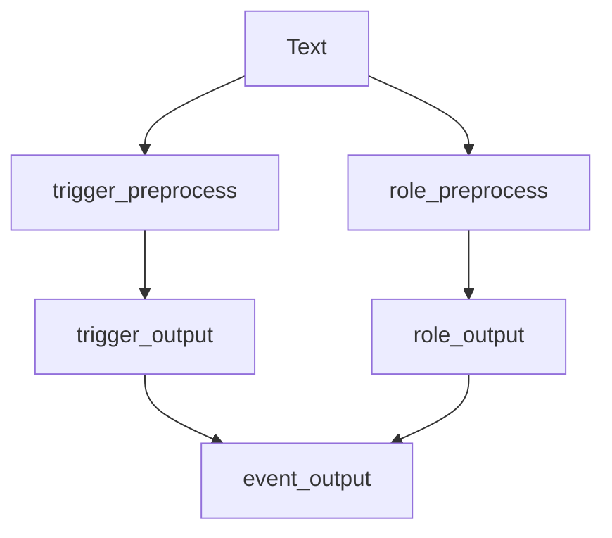

# 基于Python Backend 集成前后处理模块的PipeLine Triton Server

## 事件抽取模型
事件抽取模型分为事件类型抽取和事件相关元素抽取

### 模型介绍

#### 事件类型抽取
- 文本中可能包含多个事件，如已定义的类别包括"司法-行为-举报、竞赛行为-夺冠"等；
- 建模为多标签分类，通过预训练模型Bert获取文本语义表示，完成向量编码；
- 
```
classifier = nn.Linear(hidden_size,num_labels)
bert = BertModel()
seq_outputs = bert(input,mask,...)
class_outputs = classifier(seq_outputs)
logits = torch.sigmoid(class_outputs)
```
- 设定阈值(0.5),获取每个标签的概率值，输出所有类别中阈值符合要求的类别作为句子输出

#### 事件元素抽取
- 序列标注的方式抽取句子中的事件元素
- Bert预训练模型+crf

#### 后处理
事件抽取定义好的schema，结合事件类型及元素抽取结果完成后处理

### Triton Server

#### 流程图如下

#### 配置
1. trigger_preprocess、role_preprocess、trigger-onnx、role-onnx、role_postprocess、role_ensemble中完成相应的config.pbtxt配置； 详见代码文件
2. role_ensemble中是模型pipeline相应的配置文件,保证数据流的传导

#### 使用
服务端
```
docker run -ti -d --ipc=host --network=nlp --name=server_event  -p 11500:8000 -p 11501:8001 -p 11502:8002 -v $PWD/event_tritonmodels:/models -v $PWD/utils:/utils triton_server:event bash
tritonserver --model-store=/models --log-verbose=2
```
客户端

```
docker run -it -d --ipc=host --network=host \
  -v $PWD:/workspace/pipelines \
  --name client1 \
  nvcr.io/nvidia/tritonserver:21.05-py3-sdk
```

demo 测试
见client.py

性能 测试 batch_size = 32 ;
          38ms/sentence
